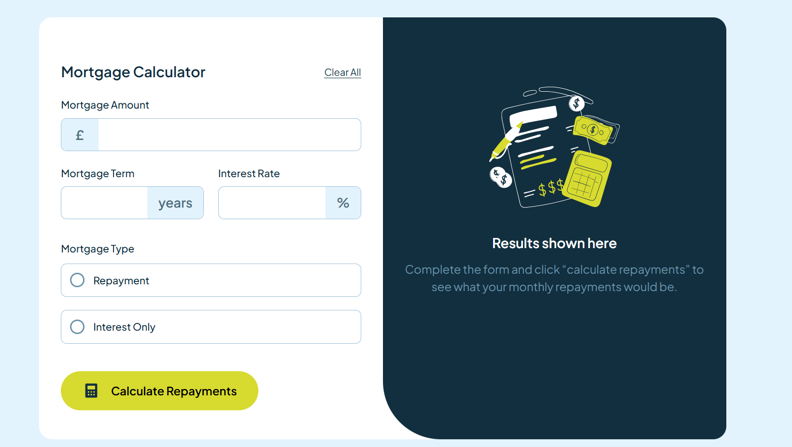

# Frontend Mentor - Mortgage repayment calculator solution

This is a solution to the **Mortgage repayment calculator** challenge on [Frontend Mentor](https://www.frontendmentor.io/challenges/mortgage-repayment-calculator-Galx1LXK73). Frontend Mentor challenges help you improve your coding skills by building realistic projects. 

## Table of contents

- [Frontend Mentor - Mortgage repayment calculator solution](#frontend-mentor---mortgage-repayment-calculator-solution)
  - [Table of contents](#table-of-contents)
  - [📌 Overview](#-overview)
    - [🔹 The Challenge](#-the-challenge)
    - [🖼️ Screenshot](#️-screenshot)
    - [🔗 Links](#-links)
  - [🛠 My Process](#-my-process)
    - [🧱 Built With](#-built-with)
    - [📚 What I Learned](#-what-i-learned)
    - [🚀 Continued Development](#-continued-development)
    - [Useful resources](#useful-resources)
  - [👤 Author](#-author)

## 📌 Overview

### 🔹 The Challenge

Users should be able to:

- Input mortgage information and see monthly repayment and total repayment amounts after submitting the form
- See form validation messages if any field is incomplete
- Complete the form only using their keyboard
- View the optimal layout for the interface depending on their device's screen size
- See hover and focus states for all interactive elements on the page

### 🖼️ Screenshot

### 🔗 Links

-  **Solution URL:** *Coming soon* 
-  **Live Site URL:** https://90-days-coding.vercel.app/

## 🛠 My Process

### 🧱 Built With

- **Semantic & accessible HTML**
- **CSS custom properties**
- **Flexbox & responsive layout techniques**
- **Vanilla JavaScript for form logic & calculations**
- **Mobile-first workflow**

### 📚 What I Learned

Working through this project helped reinforce:

- How to build clean, modular input components with prefix/suffix spans

- Using :focus-within to create more intuitive input highlight states

- Implementing mortgage amortization formulas using JavaScript

- Structuring UI states: empty, error, and completed results

- Managing DOM visibility without re-rendering whole components

### 🚀 Continued Development

This project is still **under construction**, and I plan to expand on:

- Building more reusable UI components

- Improving accessibility with ARIA attributes

- Writing more scalable JavaScript patterns

- Implementing automated tests for calculation logic

### Useful resources

- **MDN Web Docs** -- Math.pow() and financial formulas
- **Frontend Mentor community** -- solutions for alternative UI patterns
-   **ChatGPT** -- debugging, ideas, code structure
-   **Claude AI** -- explanations and refining logic
-   **YouTube tutorials** -- Input and form Styling, DOM manipulation
-   **W3Schools** -- quick syntax checks
-   **CSS-Tricks** -- Using :focus-within for form UX

## 👤 Author

-   **Name:** Adefila Enilara Adebukola
-   **GitHub:** https://www.github.com/3nylar
-   **Frontend Mentor:** *Coming soon*
